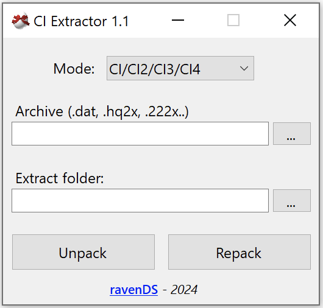

# Chicken-Extractor

An Unpacker/Repacker for <a href="https://www.interactionstudios.com/games.php">Chicken Invaders</a> archives  

* Supports **Chicken Invaders Universe**
* Supports **CI2/CI3/CI4/CI5**
* **CI3, CI4 and CI5 have not been extensively tested**

# Notes

**DO NOT DISTRIBUTE YOUR GAME FILES.** 
**DO NOT MOD 18+ CONTENT.  
DO NOT MOD COPYRIGHTED CONTENT.**
 **YOU WILL RUIN IT FOR EVERYONE.**

I am not affiliated with InterAction Studios in any way. This tool is provided "as is" without any guarantees or warranties of any kind, whether expressed or implied, including but not limited to the implied warranties of merchantability, fitness for a particular purpose, or non-infringement. 

By using this tool, you acknowledge and agree that I am not responsible for any damages, losses, or issues that may arise from its use, including but not limited to data loss or software damage. The use of this tool is entirely at your own risk.

It is your responsibility to ensure that the tool is appropriate for your use case and that you have backed up all important data before using it. This tool may modify files or data, and I cannot guarantee that such operations will perform as intended in every scenario.

**Based on work by Luigi Auriemma:**  
<a href="https://aluigi.altervista.org/bms/chicken_invaders_universe.bms"> CIU BMS script </a> 
<a href="https://aluigi.altervista.org/bms/chicken_invaders_tga.bms"> Chicken Invaders TGA script </a> 

